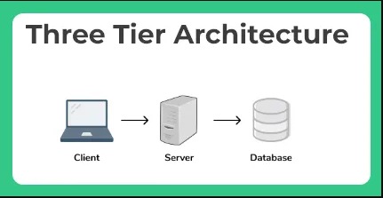

# la_kantina_be

## Project setup
Pentru executarea proiectului este necesar să aveți instalat docker și docker-compose.
După acest pas, rulați următoarele comenzi:
```
docker compose build
```

### Project run
```
docker compose up
```

Pentru construirea back-endului am mers pe 3-layered architecture si am aplicat principiile de Repository, pentru care am facut cate o clasa Repository pentru fiecare entitate din baza de date si de MVC, unde view-ul este aplicatia de front-end.



Primul strat al aplicației cuprinde rutele, partea de aplicație cu care comunică interfața grafică. Acest strat este reprezentat de fișierul `app.py`. Acesta este un fișier de tipul `Flask` care conține rutele aplicației. În acest strat se face validarea datelor primite de la interfața grafică și se apelează funcțiile din stratul următor.

Următorul strat este reprezentat de servicii, câte un fișier pentru fiecare funcționalitate (conturi, rezervari, mese). Acest strat conține funcțiile care se ocupă de logica aplicației. Aici se apelează funcțiile din stratul următor.

Ultimul strat este reprezentat de repository-uri, câte un fișier pentru fiecare entitate din baza de date (conturi, rezervari, mese). Acest strat conține funcțiile care se ocupă de interacțiunea cu baza de date.